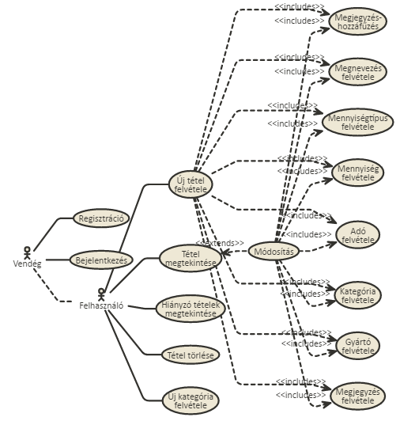

# Dokumentáció
##Raktár bevételezés

###	Célkitűzés, projektindító dokumentum
A program célja egy jól átlátható megjelenítése a tárolt tételeknek és estleges új tételek felvétele a raktárba. Legyen lehetőség regisztrációra, bejelentkezésre. Tételeket megtekinteni, újat bevinni, törölni, bevinni hiányzó tétel kérését, megjegyzést és további tételfüggő funkciókat. Ezeket csak regisztrált felhasználók tudják elérni. Legyen lehetőség kategorizálni az egyes elemeket, ezáltal csoportokba rendezni az elemeket;

###	Funkcionális követelmények:
* Regisztráció
* Bejelentkezés
* Csak bejelentkezett felhasználók által elérhető funkciók
  - új tétel felvétele a listába
  - új kategória felvétele a listába
  - létező tételek tulajdonságainak szerkesztése
  - létező tételek törlése
  - megjegyzés hozzáfűzése tételhez
  - hiányzó tételeket tartalmazó lista

###	Nem funkcionális követelmények:
*	**Könnyű áttekinthetőség:** Színekkel típus szerint csoportosítás
*	**Használhatóság:** Könnyű áttekinthetőség, logikus elrendezés, funkciók gyors elérése
*	**Megbízhatóság:** Jelszóval védett funkciók, a jelszavak védelme a háttérben. Hibásan bevitt adatok esetén jól elkülönült jelzés a felhasználónak, hibás beviteli mezők kiemelése. Megfelelő adatok űrlapban hagyása.
*	**Karbantarthatóság:** Könnyen lehessen bővíteni, moduláris rendszerfelépítés a könnyebb fejleszthetőség miatt.

###	Használatieset-modell, funkcionális követelmények

**Vendég**: Csak a publikus oldalakat éri el

*	Főoldal
*	Bejelentkezés
*	Regisztráció

**Bejelentkezett felhasználó**: A publikus oldalak elérésén felül egyéb funkciókhoz is hozzáfér.

*	Új tétel felvétele
*	Meglévő tétel megtekintése
*	Meglévő tétel módosítása
*	Meglévő tétel törlése
*	Új kategória felvétele
*	Meglévő kategória törlése
*	Meglévő kategória módosítása
*	További attributumokhoz új elem felvétele
*	További attributumokhoz meglévő elem módosítása
*	További attributumokhoz meglévő elem törlése
*	Megjegyzés írása egy tételhez

**Új kategória létrehozása:**

**Felhasználó regisztrálása:**

**Tétel hozzáadása:**

###	Adatmodellek

###	Szakterületi fogalomjegyzés

**Egy tétel tulajdonságai:**
* **ID:** A tétel adatbázis-beli azonosítója.
* **Name** A tétel megnevezése
* **Quantity type** A tétel mennyiségének típusa
* **Quantity** A tétel mennyisége
* **Price without tax** Tétel ára adó nélkül
* **Tax** A tételre vonatkozó adó
* **Category:** A tétel kategóriája.
* **First recorded:** A rendszerbe felvéve. Felvevő azonosítója feltüntetve.
* **Modified:** Tétel módosítva(mennyiség növelve, adó módosítva, stb..), dátum és a módosító azonosítója feltüntetve
* **Manufacturer** Gyártó
* **Comment:** Megjegyzés a tétellel kapcsolatban.

###	Oldaltérkép:

**Publikus:**
* Főoldal
* Bejelentkezés
* Regisztráció

**Bejelentkezett:**
* Főoldal
* Új tétel felvétele
* Listaoldal
  * Tétel törlése 
  * Tétel megtekintése
    * Tétel szerkesztése 
    * Komment hozzáfűzése

###	Végpontok

* GET/: főoldal
* GET/login: bejelentkező oldal
* POST/login: bejelentkező adatok felküldése
* GET/login/signup: regisztrációs oldal
* POST/login/signup: regisztrációs adatok felküldése
* GET/logout: kijelentkező oldal
* GET/item/list: tétellista oldal
* GET/item/new: új tétel felvétele
* POST/item/new: új tétel felvételéhez szükséges adatok felküldése
* GET/item/id: tétel adatok
* POST/item/id: új megjegyzés felvitele
* GET/item/delete=id: koktél tétel törlése
* GET/item/edit=id: tétel módosítása
* POST/item/edit=id: tétel módosítása, adatok felküldése

###	Felhasználói-felület modell

###	Oldalvázlatok:
**Főoldal - belépés és regisztráció**

**Listázó oldal**
